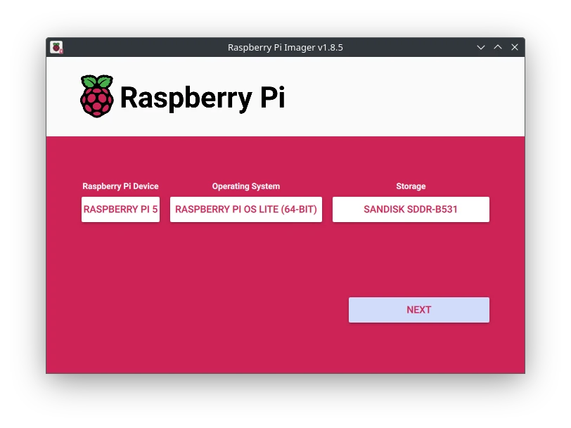
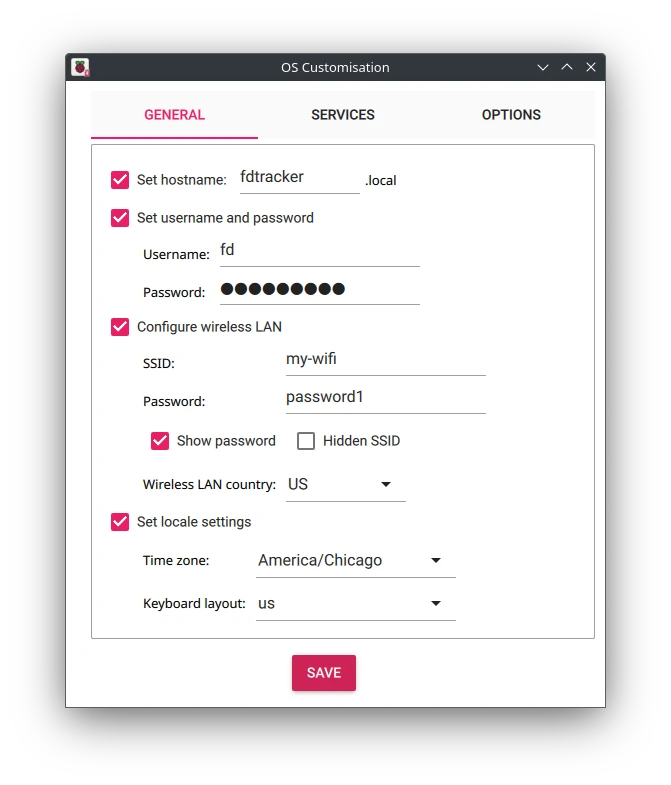

# Setting Up Freeze Dry Tracker on a Raspberry Pi

This guide will walk you through setting up the Freeze Dry Tracker application on a Raspberry Pi.

---

## 1. Download Raspberry Pi Imager

1. Visit the official Raspberry Pi website: [Raspberry Pi Imager](https://www.raspberrypi.com/software/).
2. Download and install the appropriate version for your operating system.

---

## 2. Flash Raspbian to a microSD Card

1. Insert a microSD card into your computer.
2. Open the Raspberry Pi Imager application.
3. Select the operating system:
   - Choose **Raspberry Pi OS (other)**
   - Choose **Raspberry Pi OS Lite (64-bit)**
4. Select the storage device:
   - Choose the inserted microSD card.
   
5. Click Next and Configure advanced options:
   - Set the hostname to `fdtracker.local`.
   - Enable Wi-Fi and enter your network credentials.
   - Optionally, enable SSH and set a password.
   
6. Click **Write** and wait for the process to complete.
7. Remove the microSD card and insert it into the Raspberry Pi.
8. Connect the Raspberry Pi to your network and power it on.
9. Connect a keyboard and monitor to your Raspberry Pi, or use SSH to connect remotely.

---

## 3. Clone the Repository

1. Install Updates:
   ```bash
   sudo apt update && sudo apt upgrade
   ```
2. Install Git:
   ```bash
   sudo apt install git
   ```
3. Clone the Freeze Dry Tracker repository:
   ```bash
   git clone https://github.com/mkrzywonski/fdtracker.git
   cd fdtracker
   ```

---

## 4. Install Python, Pip, and Set Up a Virtual Environment

1. Ensure Python and pip are installed:
   ```bash
   sudo apt install python3 python3-pip python3-venv
   ```
2. Create and activate a virtual environment:
   ```bash
   python3 -m venv .venv
   source .venv/bin/activate
   ```

---

## 5. Install Dependencies

1. Install the required Python packages:
   ```bash
   pip install -r requirements.txt
   ```

---

## 6. Install Gunicorn

1. Install Gunicorn for running the application:
   ```bash
   pip install gunicorn
   ```

---

## 7. Set Up the Systemd Service

1. Copy the `fdtracker.service` file to the systemd directory:
   ```bash
   sudo cp fdtracker.service /etc/systemd/system/
   ```
2. Reload systemd to recognize the new service:
   ```bash
   sudo systemctl daemon-reload
   ```

---

## 8. Enable and Start the Application

1. Enable the service to start on boot:
   ```bash
   sudo systemctl enable fdtracker
   ```
2. Start the service:
   ```bash
   sudo systemctl start fdtracker
   ```
3. Verify the service is running:
   ```bash
   sudo systemctl status fdtracker
   ```

---

## 9. Set Up Nginx as a Reverse Proxy

1. Install Nginx:
   ```bash
   sudo apt install nginx
   ```
2. Create an Nginx configuration file for the application:
   ```bash
   sudo nano /etc/nginx/sites-available/fdtracker
   ```
   Add the following content:
   ```nginx
   server {
       listen 80;
       server_name fdtracker.local;

       location / {
           proxy_pass http://127.0.0.1:5000;
           proxy_set_header Host $host;
           proxy_set_header X-Real-IP $remote_addr;
           proxy_set_header X-Forwarded-For $proxy_add_x_forwarded_for;
           proxy_set_header X-Forwarded-Proto $scheme;
       }
   }
   ```
3. Enable the configuration:
   ```bash
   sudo ln -s /etc/nginx/sites-available/fdtracker /etc/nginx/sites-enabled/
   ```
4. Test the Nginx configuration:
   ```bash
   sudo nginx -t
   ```
5. Restart Nginx to apply the changes:
   ```bash
   sudo systemctl restart nginx
   ```

---

## Accessing the Application

Once the setup is complete, you can access the application in your browser at:

```
http://fdtracker.local
```

Enjoy using the Freeze Dry Tracker! 🚀
